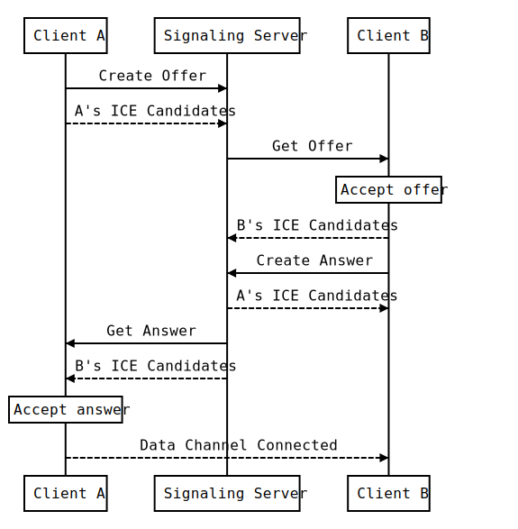

# Signaling Server in AWS Lambda

A signaling server enables setting up end-to-end [WebRTC](https://webrtc.org/) communication channel between peers (i.e. browsers). The server serves as a middle agent for exchanging peers' information when peers have not yet known with each other.



As shown in the above diagram, the information exchange starts with [createOffer](https://developer.mozilla.org/en-US/docs/Web/API/RTCPeerConnection/createOffer) which creates an SDP offer for describing a p2p connection including information such as codec and source address. 

Another client gets the offer and responses with [createAnswer](https://developer.mozilla.org/en-US/docs/Web/API/RTCPeerConnection/createAnswer) which creates an SDP answer.

During these steps, the information of [ICE Candidate](https://developer.mozilla.org/en-US/docs/Web/API/RTCIceCandidate) is also exchanged via the signaling server as a medium. The `ICE Candidate` describes the protocols and routing needed for communicating with the remote client. 

After the exchange, clients will be able to find each other for a p2p communication.

## APIs

The lambda function services only one single HTTP endpoint. It only accepts HTTP `Post` method. Different handlers are applied according to the field `"method"` in the Request Body. 

The success response is with status code 200, where the response is in Json format.

The error response is with status code 400, where the body is the error message in plain text format.


|Method|Request Body|Response Body|Note|
|:---|:---|:---|:---|
|`create_data_channel`|<pre>{<br>  "method": "create_data_channel"<br>}</pre>|<pre>{<br>  "channel_id": channel_id<br>}</pre>|The UUID `channel_id` is created by the server. A record with `channel_id` as a key will be created in the [DB](#dynamodb) with TTL = 300s.|
|`create_offer`|<pre>{<br>  "method": "create_offer",<br>  "channel_id": channel_id,<br>  "offer": offer<br>}</pre>|-|Error response if `channel_id` has not been created before.|
|`get_offer`|<pre>{<br>  "method": "get_offer",<br>  "channel_id": channel_id<br>}</pre>|<pre>{<br>  "offer": offer<br>}</pre>|Error response if `channel_id` or offer has not been created before.|
|`create_candidate`|<pre>{<br>  "method": "create_candidate",<br>  "channel_id": channel_id,<br>  "candidate": candidate<br>}</pre>|-|The value `candidate` will be appended to the list in DB if the list does not contain it. Error response if `channel_id` has not been created before.|
|`create_answer`|<pre>{<br>  "method": "create_answer",<br>  "channel_id": channel_id,<br>  "answer": answer<br>}</pre>|-|Error response if an answer has already been created, or the `channel_id` has not been created before.|
|`get_candidates`|<pre>{<br>  "method": "get_candidates",<br>  "channel_id": channel_id<br>}</pre>|<pre>{<br>  "items": [candidate, ...]<br>}</pre>|Error response if `channel_id` has not been created before.|
|`get_answer`|<pre>{<br>  "method": "get_answer",<br>  "channel_id": channel_id<br>}</pre>|<pre>{<br>  "answer": answer<br>}</pre>|Error response if `channel_id` or answer has not been created before.|

## DynamoDB

DynamoDB is used as a persistent storage for storing peers' information. The data will be erased after timeout (TTL set by the attribute `expire_time`).

The partition key is `channel_id`, and the other attributes are:
- `offer`, a String
- `answer`, a String
- `candidate`, a list of String
- `expire_time`, a Int (Unix Timestamp)

## Build

```sh
pip install --target package -r requirements.txt
```

Add `--upgrade` at the end if you need to update the existing `package` folder.

## Deploy (using Aws Cli)

Assume you use the Aws CLI to [login](https://docs.aws.amazon.com/signin/latest/userguide/command-line-sign-in.html) with a profile which has the sufficient access rights to services (e.g. lambda, dynamoDB).

The first step is to create a zip file to upload. Take reference to the script [package.cmd](package.cmd) to see how the zip file can be created in Windows. You can also take reference to the official guide [here](https://docs.aws.amazon.com/lambda/latest/dg/python-package.html).

To create the function,
```sh
aws lambda create-function --function-name my-signaling-py --runtime python3.12 --role arn:aws:iam::001234567890:role/my-lambda --handler lambda_function.lambda_handler --zip-file fileb://lambda_function.zip
```

***Please change the parameters according to your project. E.g. updating the function name and role ARN.***

To update the function,
```sh
aws lambda update-function-code --function-name my-signaling-py --zip-file fileb://lambda_function.zip
```

